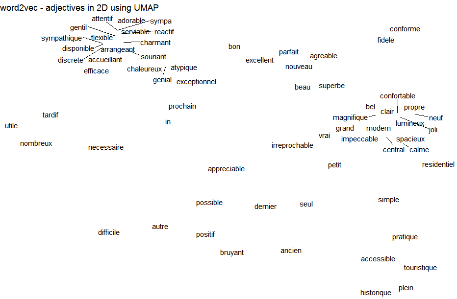

# word2vec 

This repository contains an R package allowing to build a word2vec model

- It is based on the paper *Distributed Representations of Words and Phrases and their Compositionality* [[Mikolov et al.](https://arxiv.org/pdf/1310.4546.pdf)]
- This R package is an Rcpp wrapper around https://github.com/maxoodf/word2vec
- The package allows one 
    - to train word embeddings using multiple threads on character data or data in a text file
    - use the embeddings to find relations between words

## Installation

- For regular users, install the package from your local CRAN mirror `install.packages("word2vec")`
- For installing the development version of this package: `remotes::install_github("bnosac/word2vec")`

Look to the documentation of the functions

```{r}
help(package = "word2vec")
```

## Example

- Take some data and standardise it a bit

```{r}
library(udpipe)
data(brussels_reviews, package = "udpipe")
x <- subset(brussels_reviews, language == "nl")
x <- tolower(x$feedback)
```

- Build a model

```{r}
library(word2vec)
set.seed(123456789)
model <- word2vec(x = x, type = "cbow", dim = 15, iter = 20)
embedding <- as.matrix(model)
embedding <- predict(model, c("bus", "toilet"), type = "embedding")
lookslike <- predict(model, c("bus", "toilet"), type = "nearest", top_n = 5)
lookslike
$bus
 term1  term2 similarity rank
   bus   voet  0.9891888    1
   bus gratis  0.9886125    2
   bus   tram  0.9885917    3
   bus    ben  0.9844405    4
   bus   auto  0.9780166    5

$toilet
  term1     term2 similarity rank
 toilet  koelkast  0.9856260    1
 toilet    douche  0.9830786    2
 toilet      wifi  0.9779336    3
 toilet voldoende  0.9723337    4
 toilet    werkte  0.9677669    5
```

- Save the model and read it back in and do something with it

```{r}
write.word2vec(model, "mymodel.bin")
model     <- read.word2vec("mymodel.bin")
terms     <- summary(model, "vocabulary")
embedding <- as.matrix(model)
```

## Visualise the embeddings



- Using another example, we get the embeddings of words together with parts of speech tag (Look to the help of the udpipe R package to easily get parts of speech tags on text)

```{r}
library(udpipe)
data(brussels_reviews_anno, package = "udpipe")
x <- subset(brussels_reviews_anno, language == "fr" & !is.na(lemma) & nchar(lemma) > 1)
x <- subset(x, xpos %in% c("NN", "IN", "RB", "VB", "DT", "JJ", "PRP", "CC",
                           "VBN", "NNP", "NNS", "PRP$", "CD", "WP", "VBG", "UH", "SYM"))
x$text <- sprintf("%s//%s", x$lemma, x$xpos)
x <- paste.data.frame(x, term = "text", group = "doc_id", collapse = " ")

model     <- word2vec(x = x$text, dim = 15, iter = 20, split = c(" ", ".\n?!"))
embedding <- as.matrix(model)
```

- Perform dimension reduction using UMAP + make interactive plot of only the adjectives for example

```{r}
library(uwot)
viz <- umap(embedding, n_neighbors = 15, n_threads = 2)

## Static plot
library(ggplot2)
library(ggrepel)
df  <- data.frame(word = gsub("//.+", "", rownames(embedding)), 
                  xpos = gsub(".+//", "", rownames(embedding)), 
                  x = viz[, 1], y = viz[, 2], 
                  stringsAsFactors = FALSE)
df  <- subset(df, xpos %in% c("NN"))
ggplot(df, aes(x = x, y = y, label = word)) + 
  geom_text_repel() + theme_void() + 
  labs(title = "word2vec - adjectives in 2D using UMAP")

## Interactive plot
library(plotly)
plot_ly(df, x = ~x, y = ~y, type = "scatter", mode = 'text', text = ~word)
```

## Pretrained models

- Pretrained models are available for English at https://github.com/maxoodf/word2vec#basic-usage
- **Note that external models not trained and saved with this R package, you need to set normalize=TRUE. This holds for models e.g. trained with Gensim or the models made available at sentencepiece**

```{r}
library(word2vec)
model <- read.word2vec(file = "cb_ns_500_10.w2v", normalize = TRUE)
```

### Examples on word similarities, classical analogies and embedding similarities

- Which words are similar to fries or money

```{r}
predict(model, newdata = c("fries", "money"), type = "nearest", top_n = 5)
$fries
 term1         term2 similarity rank
 fries       burgers  0.7641346    1
 fries cheeseburgers  0.7636056    2
 fries  cheeseburger  0.7570285    3
 fries    hamburgers  0.7546136    4
 fries      coleslaw  0.7540344    5

$money
 term1     term2 similarity rank
 money     funds  0.8281102    1
 money      cash  0.8158758    2
 money    monies  0.7874741    3
 money      sums  0.7648080    4
 money taxpayers  0.7553093    5
```

- Classical example: king - man + woman = queen

```{r}
wv <- predict(model, newdata = c("king", "man", "woman"), type = "embedding")
wv <- wv["king", ] - wv["man", ] + wv["woman", ]
predict(model, newdata = wv, type = "nearest", top_n = 3)
     term similarity rank
     king  0.9479475    1
    queen  0.7680065    2
 princess  0.7155131    3
```

- What could Belgium look like if we had a government or Belgium without a government. Intelligent :)

```{r}
wv <- predict(model, newdata = c("belgium", "government"), type = "embedding")

predict(model, newdata = wv["belgium", ] + wv["government", ], type = "nearest", top_n = 2)
        term similarity rank
 netherlands  0.9337973    1
     germany  0.9305047    2
     
predict(model, newdata = wv["belgium", ] - wv["government", ], type = "nearest", top_n = 1)
   term similarity rank
belgium  0.9759384    1
```

- They are just numbers, you can prove anything with it

```{r}
wv <- predict(model, newdata = c("black", "white", "racism", "person"), type = "embedding")
wv <- wv["white", ] - wv["person", ] + wv["racism", ] 

predict(model, newdata = wv, type = "nearest", top_n = 10)
            term similarity rank
           black  0.9480463    1
          racial  0.8962515    2
          racist  0.8518659    3
 segregationists  0.8304701    4
         bigotry  0.8055548    5
      racialized  0.8053641    6
         racists  0.8034531    7
        racially  0.8023036    8
      dixiecrats  0.8008670    9
      homophobia  0.7886864   10
      
wv <- predict(model, newdata = c("black", "white"), type = "embedding")
wv <- wv["black", ] + wv["white", ]

predict(model, newdata = wv, type = "nearest", top_n = 3)
    term similarity rank
    blue  0.9792663    1
  purple  0.9520039    2
 colored  0.9480994    3
```


## Support in text mining

Need support in text mining?
Contact BNOSAC: http://www.bnosac.be

